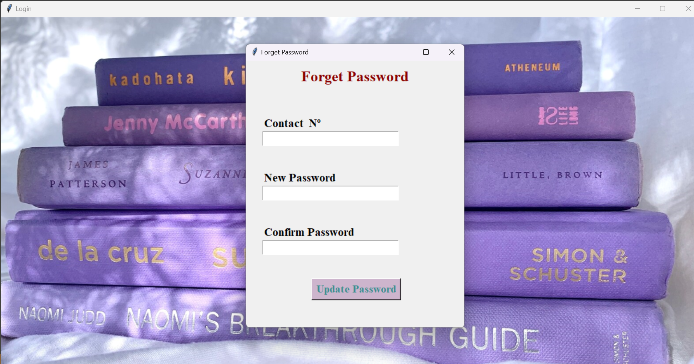
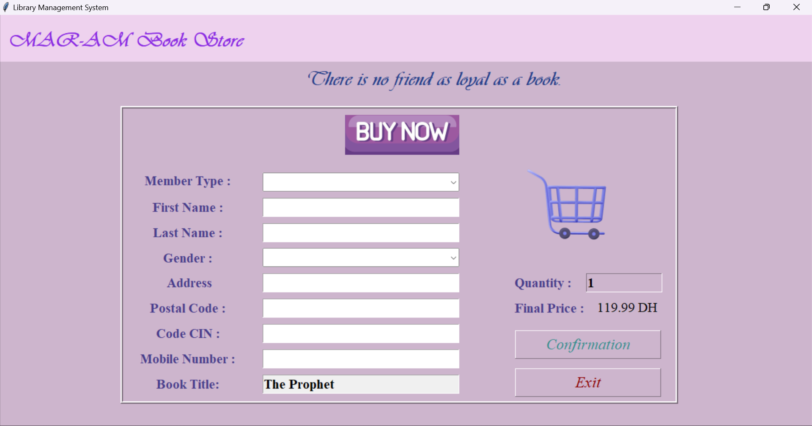

# Library-Management-System

-->  Library Management System - User Authentication

This Python script implements a user authentication system for a Library Management System using Tkinter for the GUI. It allows users to log in, register as a new user, and reset their password if forgotten. The script connects to a MySQL database to perform user authentication and password management tasks. Users can log in with their username and password, and if the credentials are correct, they gain access to the library system. If the user forgets their password, they can reset it by providing their contact number and setting a new password. The application provides appropriate error messages for invalid input and ensures data integrity by validating user inputs before performing database operations.

--> Library Management System - User Registration

This Python script enables user registration functionality for a Library Management System using Tkinter for the GUI. Users can register by providing their personal information such as first name, last name, contact number, email, and password. The script validates user input to ensure all required fields are filled, passwords match, and users agree to the terms and conditions. It also checks if the user already exists in the database before registering. Upon successful registration, the user is welcomed to the MAR-AM BOOK STORE with a success message. Users can also navigate to the login page using the "Login Now" button. The script connects to a MySQL database to store user registration information securely.

--> Library Management System - Password Reset Interface 

The `forget_psw` function is a part of a graphical user interface (GUI) designed for password reset functionality in a registration system. It prompts the user to enter their email address. If the email address is provided, it queries a database to check if the email exists. If it does, the interface allows the user to reset their password by providing a new password and confirming it. The user interface includes input fields for the contact number, new password, and confirmation of the new password. Additionally, it features a button to trigger the password update process. This function provides a simple yet effective means for users to reset their passwords securely.

--> Library Management System - MAR-AM Book Store Interface

**Description:**
The `index` class represents the main interface of the MAR-AM Book Store application. It provides users with a graphical user interface (GUI) to browse and purchase books. The interface is designed using the Tkinter library in Python.

**Key Features:**
1. **Title Label:** Displays the title of the application, "MAR-AM Book Store", in a prominent manner at the top of the interface.
2. **Book Cards:** Displays a grid of book cards, each representing a book available for purchase. Each card includes the book's cover image, price, and a "Buy Now" button.
3. **Book Information:** Each book card contains information such as the book's cover image and price. The cover image is displayed, and the price is shown below it.
4. **Buy Now Button:** Each book card includes a "Buy Now" button that allows users to initiate the purchase process for the corresponding book.
5. **Responsive Design:** The interface is designed to be responsive and user-friendly, with a clean layout and intuitive navigation.

**Functionality:**
- The user can browse through the available books displayed on the interface.
- Upon clicking the "Buy Now" button of a book, the user is redirected to the `Buy_2` interface to complete the purchase process.
- The interface provides a seamless and visually appealing experience for users to explore and purchase books from the MAR-AM Book Store.

--> Library Management System - MAR-AM Book Store Purchase Confirmation

**Description:**
The `Buy_2` class represents the interface where users can confirm their purchase details before completing the order in the MAR-AM Book Store application. This interface is designed to collect customer information and display the final price of the order.

**Key Features:**
1. **Title Label:** Displays the title of the application, "MAR-AM Book Store", at the top of the interface.
2. **Purchase Confirmation Form:** Includes fields to collect customer information such as member type, first name, last name, gender, address, postal code, code CIN, mobile number, and book title. Users can select member type and gender from dropdown menus.
3. **Confirmation Button:** Allows users to confirm their purchase details. Upon clicking this button, the order information is saved to the database, and a success message is displayed.
4. **Exit Button:** Allows users to exit the application.
5. **Final Price Display:** Shows the final price of the order based on the quantity entered by the user.

**Functionality:**
- Users can enter their personal information and select member type and gender from dropdown menus.
- The "Confirmation" button saves the order details to the database and displays a success message upon successful completion.
- The final price of the order is dynamically calculated based on the quantity entered by the user.
- Users can exit the application by clicking the "Exit" button.

**Note:** The functionality for dynamically calculating the final price based on the quantity entered is currently commented out in the code. You may uncomment and implement it as needed.

---> MAR-AM Library Management System

**Description:**
The MAR-AM Library Management System is a Python-based application built using the Tkinter library for creating a user-friendly graphical interface. This system allows library administrators to efficiently manage library membership information, track book details, and perform CRUD operations on the library database.

Users can add, update, and delete member information, including details such as member type, name, address, contact information, and book transactions. The application provides a convenient interface for entering book details, such as title, author name, edition, price, and purchase date. Additionally, it includes features for browsing and selecting books from a pre-defined list, automating the population of book details when a selection is made.

With a well-organized layout and intuitive user interface, the MAR-AM Library Management System aims to streamline library operations, enhance data management, and improve overall efficiency in library administration.
